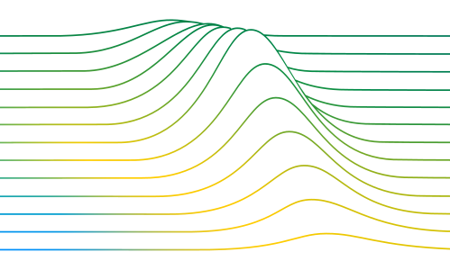

# PhD Thesis Repository

 

This repository contains all code necessary to reproduce the results of my PhD thesis on unsupervised multivariate time-series anomaly detection.
Before reproducing the results, however, it is highly recommended to first read the thesis, or, at least, the chapters of interest.
The manuscript can be found [here]().

## Documentation

The documentation corresponding to this repository can be read [here](https://lcs-crr.github.io/Thesis/).