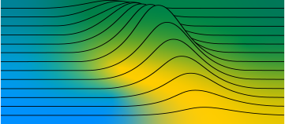

# PhD Thesis Repository

This repository contains all code necessary to reproduce the results of my PhD thesis on unsupervised multivariate time-series anomaly detection.

Before reproducing the results, it is highly recommended to first read the thesis, or at least the chapters of interest. The manuscript can be found [here]().
