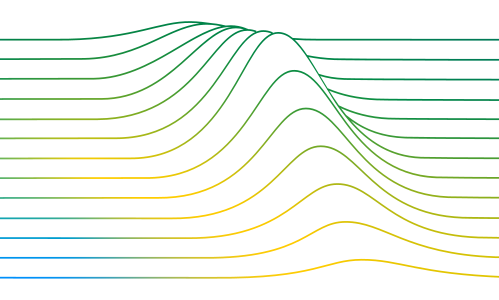

# PhD Thesis Repository

This repository contains all code necessary to reproduce the results of my PhD thesis on unsupervised multivariate time-series anomaly detection.

Before reproducing the results, it is highly recommended to first read the thesis, or at least the chapters of interest.

## Documentation

The documentation corresponding to this repository can be read [here](https://lcs_crr.codeberg.page/Thesis/).

## Dissertation
A permanent link to the dissertation and propositions can be found [here](https://hdl.handle.net/1887/4309435).

## Defence
A recording of the lay talk and the defence itself can be found [here](https://youtu.be/b24m_yDxaeM?si=3DYNBlQkpmjvMqFZ).
